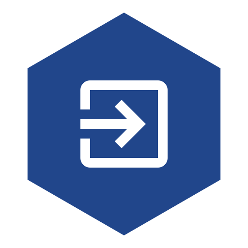
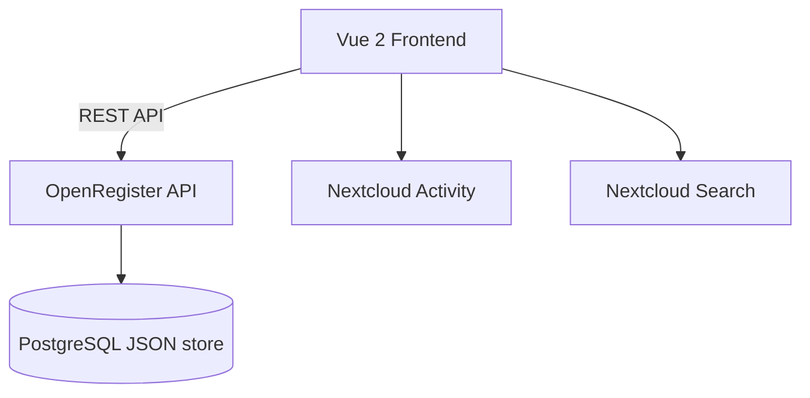

<p align="center">
  
</p>

<h1 align="center">Portaliq</h1>

<p align="center">
  <strong>One shared external portal for clients and suppliers — organisation-agnostic.</strong>
</p>

<p align="center">
  <a href="https://codeberg.org/Conduction/portaliq/releases"></a>
  <a href="https://codeberg.org/Conduction/portaliq/src/branch/main/LICENSE"></a>
  <a href="https://ci.codeberg.org/repos/Conduction/portaliq"></a>
</p>

---

Portaliq is the fleet's shared external portal. Instead of every app building its
own portal, Portaliq gives **clients** (citizens) and **suppliers** (companies)
one integrated, white-label portal to see and act on their records across every
app — reading data through **OpenRegister** and rendering each app's registered
*portal contribution*. It owns the external auth edge (DigiD / eHerkenning /
eIDAS), the white-label portal shell, the unified inbox, and the
portal-contribution registry. Employees stay internal.

> **Architecture:** hydra **ADR-046** — *Portaliq: one shared external portal,
> apps hook in.* First slice + reference implementation:
> [`openspec/changes/supplier-portal`](openspec/changes/supplier-portal) (procest
> is the first contributor).

> **Two frontends, two audiences** — this app is built on the ConductionNL
> Nextcloud app template. The template's **Vue 2.7 / nc-vue** stack (below) powers
> Portaliq's *internal* admin surface (managing contributions + tenant config).
> The *public* portal is a separate **React + NL Design System** SPA
> (`src/portal/`, built by `webpack.portal.js` → `npm run build:portal`), served
> at `/portal` via a `#[PublicPage]` template — the tilburg-woo-ui pattern for an
> external white-label surface. The template docs below describe the Vue admin side.

> **Manifest-first** — pages, navigation, and dependencies are declared in `src/manifest.json`. The shell (CnAppRoot) reads the manifest at boot and renders index / detail / dashboard / settings pages without per-page Vue files. Reach for a custom Vue component only when the page is `type: "custom"`. See `openspec/architecture/` and hydra ADR-024 for the architectural rationale.

> **Pre-wired for [OpenRegister](https://codeberg.org/Conduction/openregister)** — `manifest.dependencies` lists `openregister`, so CnAppRoot's dependency-check phase ensures the OR app is installed and enabled before the UI mounts. If your app does not need OpenRegister, remove the entry from `src/manifest.json`, `appinfo/info.xml`, and `openspec/app-config.json`.

> **Canonical root configs** — `phpcs.xml`, `phpmd.xml`, `psalm.xml`, `phpstan.neon`, and `phpstan-bootstrap.php` in this repo are the fleet canonical. All Conduction PHP apps are expected to mirror these files byte-for-byte; per-app deviations belong in baselines (`phpstan-baseline.neon`, `psalm-baseline.xml`) not in the canonical files. Submit changes here and they propagate to the fleet via the template-sync flow — do **not** diverge per-app.

## Screenshots

Screenshots are captured automatically from the tutorial flows, not pasted in by hand. The journeydoc scaffold (hydra ADR-030) ships two tutorial stories under [`docs/tutorials/`](docs/tutorials/) — a user "first launch" walkthrough (the Dashboard) and an admin "manage settings" walkthrough (Admin Settings) — and a Playwright `docs-capture` project that turns each documented step into a PNG under `docs/static/screenshots/tutorials/`.

- Add a tutorial story: `/journeydoc-add-story`
- Add stable `data-testid` hooks to a Vue component: `/journeydoc-instrument`
- (Re)capture screenshots against a running Nextcloud: `NEXTCLOUD_URL=http://localhost:8080 npx playwright test --project docs-capture`

See the [Documentation](#documentation) section below for how the docs site itself is built and deployed.

## Features

Features are defined in [`openspec/specs/`](openspec/specs/). See the [roadmap](openspec/ROADMAP.md) for planned work.

### Core
- **Dashboard** — Personal overview page with key information at a glance
- **Admin Settings** — Configurable settings panel for administrators

### Supporting
- **OpenRegister Integration** — Pre-wired data layer using OpenRegister objects
- **Quality Pipeline** — PHPCS, PHPMD, Psalm, PHPStan, ESLint, Stylelint

## Architecture



_Update this diagram during `/app-explore` sessions as the architecture evolves._

### Data Model

| Object | Description |
|--------|-------------|
| _(define your data objects here)_ | — |

_Data model is defined using OpenRegister schemas. See [`openspec/specs/`](openspec/specs/) for feature-level design decisions and [`openspec/architecture/`](openspec/architecture/) for architectural decisions._

### Portal API (external subjects)

The public portal SPA talks to these endpoints. All `contribution#*` routes are
guarded by `PortalAuthMiddleware` (bearer session required, fail-closed 401);
the session routes are the public auth edge.

| Method | Path | Purpose |
|--------|------|---------|
| `GET` | `/apps/portaliq/portal/api/session` | Resolve the caller's bearer to a subject (401 without one) |
| `POST` | `/apps/portaliq/portal/api/session/dev-login` | Mint a dev session (debug-gated; issues `trust: low`) |
| `DELETE` | `/apps/portaliq/portal/api/session` | End the client session |
| `POST` | `/apps/portaliq/portal/api/session/refresh` | Rotate the bearer within the absolute session lifetime cap (portal-session-hardening-v2) — mints a NEW `jti`, revokes the OLD one; fails closed (401) on a revoked/expired/malformed bearer, past the cap, or when the edge is unconfigured |
| `GET` | `/apps/portaliq/portal/api/session/oidc/start?org=&provider=` | Start a broker OIDC login (portal-oidc-broker-login) — 302 to the broker's authorization endpoint with `state`+`nonce`+PKCE; fails closed (generic error, no redirect) on an unconfigured org/provider |
| `GET` | `/apps/portaliq/portal/api/session/oidc/callback` | Broker OIDC callback — validates the ID token, maps claims, mints the session, 302s to the SPA with the bearer in the URL fragment; fails closed to the SAME generic error on ANY validation failure |
| `GET` | `/apps/portaliq/portal/api/contributions` | The subject's aggregated manifest (audience- and trust-filtered), carrying the subject's own unread inbox count (`unreadCount`, portal-inbox-v2) |
| `GET` | `/apps/portaliq/portal/api/inbox` | The subject's unified inbox (portal-inbox-v2): every `kind: inbox` collection across ALL their contributions, merged, sorted by `receivedAt` descending, each row tagged with its source `appId`/label. Every row passes the IDENTICAL per-row subject + tenant + trust boundary as a normal collection read; fails closed to an empty inbox on any per-collection OR error |
| `PATCH` | `/apps/portaliq/portal/api/inbox/{register}/{schema}/{id}/read` | Mark ONE inbox message read (portal-inbox-v2), tamper-proof: ownership/tenant/trust re-verified BEFORE any write, only the `read` field is ever set (any other body field is ignored), and a foreign-owned/absent id 404s identically to every other scoped write — no existence oracle |
| `GET` | `/apps/portaliq/portal/api/collections/{register}/{schema}` | Read one collection, subject-scoped with per-row verification |
| `POST` | `/apps/portaliq/portal/api/collections/{register}/{schema}` | Create an object via a declared `type: create` action (whitelisted fields only) |
| `GET` | `/apps/portaliq/portal/api/collections/{register}/{schema}/{id}` | Read a single object, subject-scoped; per-row ownership re-verified (404 for a foreign-owned or absent id — no existence oracle) |
| `PATCH` | `/apps/portaliq/portal/api/collections/{register}/{schema}/{id}` | Update an object via a declared `type: update` action (whitelisted fields only); ownership re-verified against OR before any write, scope field re-stamped (closes #16) |
| `POST` | `/apps/portaliq/portal/api/collections/{register}/{schema}/{id}/files` | Attach an uploaded file to an owned object; ownership re-verified server-side; the collection must declare `filesUpload: true` (403 otherwise, before any read) |
| `GET` | `/apps/portaliq/portal/api/collections/{register}/{schema}/{id}/files/{fileId}` | Stream a file attached to an owned object; ownership + tenant + trust re-verified BEFORE the file is resolved. The collection must declare `filesDownload: true`; a non-opted-in collection, a foreign/absent object, and a non-existent `fileId` all return the IDENTICAL 404 — no existence oracle, and the raw stored path is never exposed |
| `POST` | `/apps/portaliq/portal/api/actions/{appId}/{actionId}` | Forward a declared endpoint action server-to-server with a signed `X-Portal-Subject` assertion (contract v2, A6) |

#### Unified inbox (portal-inbox-v2)

A single, mark-readable inbox across every `kind: inbox` collection a
subject's contributions declare — the Berichtenbox pattern citizens already
know from MijnOverheid, and the top-tier "one inbox across organisations"
Logius wish. The SPA's Inbox nav entry is a fixed, cross-app view (not sourced
from any one contribution's own `pages`) that shows the unread count as a
badge and lets the subject mark a message read; the per-app `kind: inbox`
collections keep working unchanged for a contribution that wants its own
dedicated messages page too.

`portalMessage` (and any other `kind: inbox` schema) may optionally carry
`aard` (nature), `rechtsgevolg` (legal effect), and `termijn` (deadline) — the
WMEBV art 2:10 content-shape requirements, deferred to 2027. The SPA renders
whichever of the three a message actually supplies and nothing for the rest;
no contributing app is required to populate them before then.

### OIDC broker login — DigiD / eHerkenning / eIDAS (portal-oidc-broker-login)

Replaces the dormant dev-login-only auth edge with a real external identity
edge: a **generic, broker-agnostic OIDC Relying Party**. Portaliq is deliberately
**not** an OIDC broker itself — a Signicat-class identity broker exposes
DigiD/eHerkenning/eIDAS as plain OIDC and keeps the PKIo-certificate / Logius
metadata burden on its own side, so portaliq only ever has to be a standard
OIDC RP. `digid`/`eherkenning`/`eidas`/`generic` are *provider presets* over
that one generic RP.

**Per-organisation config.** Each Organisation may configure one broker per
provider preset via `PortalOrganisationConfigService`: `issuer`, `clientId`,
`scopes`, claim mappings (`identityRef`/`subjectRef`/`audience` — see below),
and a `loaMap` (broker LoA/`acr` → portal trust). The **client secret is
stored via its own dedicated, `sensitive`-flagged `IAppConfig` entry**
(`oidc_secret_<organisationUuid>_<provider>`) — separate from the
non-sensitive presentation-override blob, and **never** returned by any
endpoint or rendered in the SPA. An org without a configured provider simply
does not offer that login button (`resolve()`'s `oidcProviders` list).

**Claim mapping.** `identityType` is always the preset's fixed value (or, for
`generic`, an org-declared override validated against the closed register
enum). `identityRef` reads a configurable claim (default `sub`). `subjectRef`
is either the literal `derive` keyword — `PortalAccountService` mints a fresh,
cryptographically random reference on first login and reuses it on every
later login for the SAME `(identityType, identityRef, organisation)` — or a
`claim:<name>` reference into the validated ID token; it is **never** a
request parameter. `audience` is a fixed literal or a `claim:<name>`
reference. This is the change's core security invariant: the subject
reference the domain apps scope their data by is always server-derived.

**The flow.**
1. `GET .../session/oidc/start?org=&provider=` resolves the org+provider
   config (fail closed if absent), generates `state`/`nonce`/PKCE
   (`code_verifier`/`code_challenge` S256), persists them single-use and
   TTL-bounded (10 min) via the `portalOidcState` OpenRegister schema, and
   302s to the broker's `authorization_endpoint` (resolved from the issuer's
   `.well-known/openid-configuration`, cached).
2. `GET .../session/oidc/callback` consumes the `state` EXACTLY ONCE (a
   replayed or unknown `state` fails closed), exchanges the `code` at the
   `token_endpoint` with the stored PKCE verifier, and **fully validates the
   ID token**: `iss` equals the configured issuer, `aud` contains the
   `clientId`, `nonce` equals the stored nonce, `exp`/`iat` within a 60s
   clock-skew, and an **RS256 signature** verified against the broker's own
   JWKS (fetched from the discovery document's `jwks_uri`, cached, with ONE
   forced-refresh retry on failure — key-rotation tolerance).
3. Claims map to `identityType`/`identityRef`/`subjectRef`/`audience`; the
   broker's LoA (`acr` by default, per-org configurable) maps to the portal's
   `low|substantial|high` trust vocabulary via `loaMap` — **unmapped or
   missing LoA always maps to `low`, never higher** (under-privilege on
   ambiguity).
4. `PortalAccountService::findOrCreate()` resolves the `portalAccount`; the
   EXISTING `PortalSessionService::issueSession()` mints the SAME HS256
   portal session every other login path uses (recording the `login` audit
   event and stamping `authTime` for a genuine new origin, per
   portal-session-hardening-v2) and the browser is redirected to the SPA with
   the bearer in the URL **fragment** (`#token=...`, never a query string —
   never sent to the server, never in a log or Referer header).

**Fail-closed discipline (ADR-005).** `alg: none` and every non-RS256
algorithm is rejected outright (closes the classic HS256-confusion attack
too); an ambiguous/unknown JWKS key (`kid`) resolution fails closed; and
**every single failure — unknown org/provider, bad/reused state,
token-exchange error, any one of iss/aud/nonce/exp/signature, unmappable
claims, account/session mint failure — returns the IDENTICAL generic
`{"error":"oidc_failed"}` response.** No response ever distinguishes which
check failed (no oracle).

**Dev-login is unaffected.** `POST /portal/api/session/dev-login` remains
debug-gated and always issues `trust: low` — the local-development door,
unrelated to and unaffected by the OIDC edge.

**Decoupling.** The RP is a standard OIDC client and does **not** hard-depend
on OpenConnector — if OpenConnector later fronts a broker, it is just another
OIDC issuer in the per-org config, no portaliq code change.

**Production go-live is an OPS gate, not a code task.** Shipping **DigiD** to
production requires the DigiD **Normenkader 3.0** annual
ICT-beveiligingsassessment (RE auditor) **and a DPIA** — operational/compliance
gates that run in parallel with, and are not delivered by, this code change.
The edge can be built and fully tested against a broker's *acceptance*
environment while the assessment/DPIA proceed.

**Out of scope (later slices).** DigiD *Machtigen* / eHerkenning
*ketenmachtiging* delegation, and a SAML broker profile — this edge is
OIDC-only.

### Session refresh, rate limiting, and the audit trail (portal-session-hardening-v2)

**Refresh — a sliding window with an absolute cap.** The session TTL is fixed
(2h, `PortalJwtService::DEFAULT_TTL`); `POST /portal/api/session/refresh`
lets a subject filling in a long form or reading a case stay signed in past
it. A valid, unexpired, not-yet-revoked bearer mints a NEW session with a NEW
`jti` and revokes the OLD one (a rotation, never a second live token — a
stolen old bearer dies on refresh). The renewal is capped by an **absolute
maximum session lifetime** — app config `session_max_lifetime`, default 8h
(28800s) — measured from the subject's *original* login (`authTime`, carried
unchanged across every rotation in the chain, never reset by a refresh). A
refresh past the cap, on a revoked/expired/malformed bearer, or when the
signing secret is not yet configured, fails closed to the SAME generic 401 —
the subject must re-authenticate. The SPA (`src/portal/App.jsx`) calls refresh
proactively every ~25 minutes while a session is active.

**Rate limiting.** The public session endpoints (`index`/`devLogin`/`logout`/
`refresh`) and the scoped-CRUD/action surface
(`collection`/`create`/`update`/`action`/`downloadFile`) all carry
`OCP\AppFramework\Http\Attribute\AnonRateLimit` with conservative per-IP
defaults, so the auth edge and the write/forward surface are not
brute-forceable. `dev-login` additionally carries `BruteForceProtection` — the
tightest limit of any session endpoint, since a password-less mint must never
become a brute-force oracle if a debug instance is ever exposed. These limits
combine with, rather than replace, the existing `jti` revocation and
fail-closed middleware.

**Audit trail.** Every portal mutation (`create`/`update`/`forward`), every
file `download`, and every session event (`login`/`logout`/`refresh`) writes
an append-only `portalAuditEntry` (`jti`, `subjectRef`, `organisation`,
`appId`, `verb`, target `register`/`schema`/`id`, `timestamp`) via
`AuditTrailService::record()` — a **fact record only**, it never carries
payload content. A `record()` failure is caught and logged; it never reverses
the audited action (failure isolation). The count (never the subjects or
targets) is exposed per-verb via `GET /api/metrics`
(`portaliq_audit_entries_total{verb="..."}`, ADR-006). Retention is
OpenRegister's records-management concern (Archiefwet `_retention`) —
Portaliq only writes the entries, it does not rebuild a purge.

#### WMEBV submission receipts (wmebv-submission-receipts)

The **Wet modernisering elektronisch bestuurlijk verkeer** (in force
2026-01-01, BWBR0048252) makes an automatic receipt, a copy of submitted data,
and a burden-of-proof log hard duties for every electronic submission. Every
**successful** portal create-action — `ContributionController::create()` and
the `type: create` branch of `action()` (the A6 server-to-server forward) —
now generates both, via `SubmissionReceiptService::record()`:

- A **`portalMessage`** ontvangstbevestiging in the submitting subject's own
  inbox — the SAME unified inbox portal-inbox-v2 aggregates, reused rather
  than duplicated. It carries a `referenceId`, an ISO-8601 `receivedAt`,
  bilingual NL/EN B1-level `subject`/`body` text, and a `dataCopy` — the
  **whitelisted** submitted field map the create actually persisted, never
  the raw client body. NL/EN text is generated via `IL10N\IFactory::get()`
  for BOTH `nl` and `en` explicitly (portal subjects are not NC users, so
  there is no session locale to key off), not the caller's own locale.
- A **`portalSubmission`** append-only proof-of-receipt log record
  (`subjectRef`, `organisation`, `appId`, `actionId`, `payloadCopy`,
  `receiptMessageRef` linking to the receipt's `referenceId`, `submittedAt`,
  `deliveryStatus`) — the evidentiary artefact satisfying the burden-of-proof
  duty and backing the subject's right to a copy of their own submission log.

**Failure is never lossy.** The domain create is authoritative and has
already succeeded by the time `record()` runs; every failure inside it — a
thrown exception, or a write degrading to `null` — is caught, logged, and
never propagated, so a WMEBV side-effect can never turn a successful
submission into a failed one (create still returns 200). A failed
`portalSubmission` write retries once with a minimal fallback row carrying
`deliveryStatus: "failed"`, so the submission stays retriable rather than
silently missing from the proof log.

**Data-minimisation guard.** `PortalManifestNormaliser::normaliseFieldConfigs()`
honours a `fieldConfigs` entry's `required: true` ONLY when that field is
also in the action's OWN schema `required` set (resolved via
`PortalSchemaReader`); otherwise the flag is dropped fail-closed (the field
stays optional) — an unresolvable schema drops it too, never elevating on a
guess. This enforces the WMEBV rule that an electronic form may not require a
field that is not genuinely mandatory for the request.

#### External notification dispatch (portal-notifications-dispatch)

The contribution contract's manifest `notifications` list — an array of rule
keys such as `message.created` / `status.changed` — used to be declared by
apps and consumed by nothing. `NotificationDispatchService` now consumes it:
when a `portalMessage` is created for a subject (including the WMEBV receipt
above) or a status-transition update succeeds
(`ContributionController::update()`), the service resolves the subject's
aggregated manifest and checks whether the contributing app declared a
matching rule key. A missing, non-matching, or malformed declaration enqueues
nothing (fail-closed) — the feature is opt-in per contribution.

A match enqueues `NotificationDispatchJob` via `OCP\BackgroundJob\IJobList`
with a **content-free** payload (`subjectRef`, `organisation`, `audience`,
`appId`, `ruleKey` — never message content) — the send never runs inline, so
a slow or failing mail server can never slow or fail the subject's original
request. The job resolves the subject's `portalAccount`, and — when an email
is on file — sends a **privacy-minimal**, bilingual (NL first, EN second) B1
email via `OCP\Mail\IMailer`: *"You have a new message in the portal of
&lt;org&gt;"* plus a `/portal?org=<slug>` deep link, landing the subject at the
authenticated portal after login. The email **never** carries the message
subject, body, case identifiers, or any data beyond the recipient address.

Every attempt — sent or failed, including "no email on file" — appends a new
`portalNotification` row (`accountRef`, `ruleKey`, `channel`, `status`,
`attempts`, `lastAttemptAt`) rather than updating one in place, mirroring the
WMEBV burden-of-proof append-only convention `portalSubmission` already uses.
`attempts` is the consecutive-failure streak carried from the previous attempt
for the same account + rule key; it resets to 0 on a successful send. After
**N consecutive failures** (`notification_failure_threshold` app config, small
default) the subject's `portalAccount` is flagged `needsAlternativeContact` —
the WMEBV notificatieplicht (~Awb 2:11) fallback signal that an operator must
reach the subject by another channel — and cleared again on the next
successful send. `MetricsController` surfaces both counts (failed attempts,
accounts needing a fallback) **count-only**, never recipient identity:
`portaliq_notifications_failed_total`, `portaliq_accounts_needs_alt_contact`.

Only the `email` channel is implemented; `channel` is future-proofed for
`sms`/`push`. Complementary to OpenRegister's own ADR-031 notification engine
(server/tenant-side); this is the external-subject side keyed off the portal
manifest — this change does not touch the ADR-031 dialect.

### Contribution contract v2 (ADR-046 amendment)

A contributing app ships one plain class `OCA\{App}\Portal\PortalContributionProvider`
(duck-typed — no portaliq dependency). Contract v2 vocabulary, every field
optional with a v1-equivalent default:

- **`getAudiences(): array`** — multi-audience providers; preferred over the v1
  `getAudience(): string` (open audience vocabulary).
- **`minTrust`** on collections and actions — `low | substantial | high`
  (eIDAS-aligned). Below-threshold entries are filtered from the manifest AND
  rejected 403 server-side on read/create/action. Unrecognised values make the
  entry unsatisfiable for everyone (fail-closed).
- **`scopeClaim`** on a collection — scope by a server-managed claim from the
  subject's `portalAccount.claims` (`{appId: {claimName: uuid}}`) instead of
  the pseudonymous `subjectRef`. `"claimName"` resolves in the contributing
  app's own namespace, `"appId.claimName"` is explicit. Absent claim → the
  collection contributes zero rows (200 + empty, never an error).
- **`via`** on a collection — one-hop join scoping:
  `{register, schema, scopeField, targetField, match?}` (dot paths allowed in
  `scopeField`). The join pre-pass resolves the subject → a verified set of
  `targetField` values; `match` then selects how that set is applied to the
  outer rows:
  - **`match: 'id'`** (default when absent) — *forward*: keep outer rows whose
    OWN `id`/`uuid` is in the set (the join row references the outer object by
    id, e.g. zaakafhandelapp `rol`→`zaak`).
  - **`match: 'scopeField'`** — *reverse*: keep outer rows whose value at the
    collection's own `scopeField` (dot-path; scalar equality OR strict
    array-contains for a multi-value field) is in the set — for outer rows that
    carry a FOREIGN scope key, e.g. scholiq guardian → `learner-profile`
    (`guardianRefs`→learner refs) → grades WHERE `learnerRef` ∈ children.

  Both modes re-verify membership AND tenant per row; an empty verified set
  yields zero rows (never all rows); a `match` other than those two literals,
  or an invalid/nested declaration, fails closed.
- **`fields`** on a collection (any `kind`, including `inbox`) — read-side
  projection: a pure whitelist of top-level row property names. Verified rows
  come back with ONLY those properties plus the row identifier(s) (flat
  `id`/`uuid`; an `@self` envelope reduces to its `id`/`uuid` — declare
  `"@self"` to keep it whole), so staff-only fields (e.g. internal notes)
  never leave the instance. Unknown declared names are silently absent;
  `scopeField` is not auto-included; a malformed declaration projects to
  identifiers-only (never the full row). No `fields` = full rows (v1/v2
  behaviour). Projection runs AFTER per-row verification — it shapes what a
  row shows, never which rows return.
- **`type: update` action** (portal-scoped-crud, ADR-062 Phase 1) —
  `{id, type: 'update', register, schema, fields, minTrust?}`: authorises the
  `PATCH .../collections/{register}/{schema}/{id}` endpoint. Only the declared
  `fields` are accepted (the scope field is never whitelisted). Ownership of
  the client-supplied id is re-verified against OpenRegister BEFORE any write —
  the id is never trusted — and the scope field is re-stamped server-side, so a
  patch can never move a row out of, or into, another subject's scope
  (write-IDOR closed, #16). A null result (foreign-owned OR non-existent id) is
  a single 404 — no existence oracle.
- **`filesUpload`** / **`filesDownload`** on a collection (ADR-063 /
  portal-document-download) — opt a collection into the scoped file blocks; both
  default `false` and are normalised fail-closed (a malformed or absent value is
  `false`, mirroring each other exactly). `filesUpload: true` lets a subject
  attach a file to their OWN row (`POST .../{id}/files`) via OpenRegister's
  object-file store, RBAC bypassed. `filesDownload: true` lets a subject
  retrieve a file attached to their OWN row (`GET .../{id}/files/{fileId}`)
  after the SAME ownership + tenant + trust re-verification as the scoped read;
  a non-opted-in collection, a foreign/absent object, and a non-existent file
  all 404 identically (no existence oracle), and the raw stored path is never
  exposed. A successful download also invokes an audit hook (verb `download`);
  the audit ENTRY itself is written by `portal-session-hardening-v2`.
- **Endpoint actions** — `{id, label, endpoint, method?, minTrust?}` where
  `endpoint` is an **instance-local absolute path** (full URLs rejected —
  SSRF guard). Portaliq forwards server-to-server with a ~60s HS256
  `X-Portal-Subject` assertion (`sub`/`audience`/`organisation`/`trust`/`jti` +
  `use: "assertion"`); the client's own `Authorization` header is never
  forwarded, and an assertion can never be replayed as a portal session.

### Contribution manifest v3 — UI configuration (ADR-063)

The manifest MAY also carry a **presentation-only** UI-configuration vocabulary
so an app ships a schema + manifest and its subjects get a real rendered
interface — no bespoke frontend per app. Every key is optional and additive; a
fail-closed `PortalManifestNormaliser` sanitises them in the aggregate.

| Level | Keys |
|---|---|
| Collection | `columns` (`[{field, label?, render?}]`, render ∈ `text·date·datetime·badge·currency·boolean·link`), `detail` (`{layout: card·timeline, fields?}`), `defaultSort` (`{field, direction}`), `defaultFilters` |
| Action | `fieldConfigs` (per-**whitelisted**-field `{label?, visible?, required?, disabled?, size?, placeholder?, help?}`), `optionsProviders`, `submitLabel`, `successMessage` |
| Contribution | `pages` (`[{id, label?, icon?, blocks[]}]`) of typed blocks `collection·action·detail·richText·cta` |

**UI config never widens access — the invariant.** The action `fields`
whitelist, collection scope, and read-side projection remain the sole data
authorities. A `fieldConfigs`/`optionsProviders` entry for a field outside the
whitelist is dropped; a `column` naming a projected-away field renders blank; a
`collection` optionsProvider dropdown is populated through the **subject-scoped**
collection endpoint, so it can only offer values the subject may already read;
page blocks resolve only within the same (trust-filtered) contribution.
Malformed config is dropped fail-closed, never fatal. Absent `pages` →
Portaliq synthesises one default page per listable collection (v2 rendering).

**Status transitions (approve / reject / close).** A `type: update` action MAY
declare **`set`** — a map of **whitelisted** field → fixed value the *server*
applies over the client body — and a collection MAY declare **`rowActions`** (ids
of update actions, rendered as per-row buttons). The `PATCH` update endpoint takes
`?action=<id>` to pick which transition to apply. The target is **tamper-proof**:
a client PATCHing `{status: "hacked"}` against a `set: {status: "closed"}`
transition still lands on `closed`, and `set` only honours whitelisted fields, so
a transition can never move a row out of the subject's scope.

Canonical contract text: ADR-046 amendment 2026-07-06 + ADR-063 (hydra) + the
`portal-contribution-contract` spec in [`openspec/specs/`](openspec/specs/).

### Deploying the portal (production notes)

- **Build both bundles.** `npm run build` produces *both* the Vue admin bundle
  and the React portal bundle (`js/portaliq-portal.js`); the portal bundle is
  gitignored, so a release that only runs the admin build serves a 404 at
  `/portal`. `build:admin` / `build:portal` build them individually.
- **`portalAccount` claims schema.** `scopeClaim`/`via` scoping resolves the
  subject's claims from a `portalAccount` object carrying `subjectRef`,
  `audience` and `claims` (`{appId: {claimName: value}}`). Ensure the deployed
  `portalAccount` schema carries these — if another app defines a `portalAccount`
  schema it can shadow this one on OpenRegister's global slug (see the
  schema-slug-collision note in the issue tracker).
- **Transitions vs lifecycle hooks.** A `type: update` transition writes through
  OpenRegister with RBAC bypassed (portal subjects are not NC users) but does
  NOT bypass a schema's declarative lifecycle hooks. A schema whose status
  transition requires a logged-in NC user cannot be transitioned by an external
  subject via the scoped `PATCH` — use the A6 bearer-forward action or a
  portal-subject-aware hook. Keep such manifests read-only until then.
- **Cache-busting** is automatic outside `debug` mode (Nextcloud appends the app
  version to script URLs); in a `debug`-true dev instance no `?v=` is added, so
  bump the app version (or hard-reload) after redeploying the bundle.

### Directory Structure

```
portaliq/
├── appinfo/                    # Nextcloud app manifest, routes, navigation
├── lib/                        # PHP backend
│   ├── AppInfo/Application.php
│   ├── Controller/             # DashboardController, SettingsController
│   ├── Mcp/ExampleToolProvider.php  # AI Chat Companion tools (hydra ADR-034/035)
│   ├── Service/SettingsService.php
│   ├── Listener/DeepLinkRegistrationListener.php
│   ├── Repair/InitializeSettings.php
│   └── Settings/               # AdminSettings, app_template_register.json
├── templates/                  # PHP templates (SPA shells)
├── src/                        # Vue 2 frontend
│   ├── manifest.json           # Pages + menu + dependencies (v2 — the source of truth)
│   ├── main.js                 # App entry — bootstraps CnAppRoot from manifest
│   ├── App.vue                 # Mounts CnAppRoot + #sidebar slot
│   ├── registry.js             # v2 five-kind component registry (widget/modal/page/form-field/cell-renderer)
│   ├── customComponents.js     # v1 registry (kept for backward-compat; remove once v2 migration complete)
│   ├── modals/                 # kind: "modal" components (ExampleModal.vue)
│   ├── formFields/             # kind: "form-field" components (EmailField.vue)
│   ├── cellRenderers/          # kind: "cell-renderer" components (StatusBadge.vue)
│   ├── settings.js             # Nextcloud admin settings webpack entry-point
│   ├── store/                  # Pinia stores (used by AdminSettings)
│   └── views/CustomExample.vue # Example custom component (registry demo)
├── openspec/                   # Specifications, decisions, and roadmap
│   ├── app-config.json         # Canonical app config (id, goal, dependencies, CI)
│   ├── config.yaml             # OpenSpec CLI configuration
│   ├── specs/                  # Feature specs (input for OpenSpec changes)
│   ├── architecture/           # App-specific Architectural Decision Records
│   ├── ROADMAP.md              # Product roadmap
│   └── changes/                # OpenSpec change directories (created on first change)
├── docs/                       # Docusaurus documentation site (@conduction/docusaurus-preset)
│   ├── docusaurus.config.js    # Site config — title, url, navbar, brand theme
│   ├── intro.md                # Docs landing page
│   ├── src/pages/index.js      # Marketing landing page (brand <DetailHero> / <WidgetShelf>)
│   ├── tutorials/              # journeydoc tutorial stories — user/ + admin/ tracks (ADR-030)
│   └── static/screenshots/     # Captured tutorial screenshots (populated by docs-capture)
├── tests/                      # Unit and integration tests
│   ├── e2e/docs-screenshots.spec.ts # journeydoc screenshot capture suite (Playwright docs-capture project)
│   ├── validate-manifest.js    # Ajv schema validator for src/manifest.json (nc-vue manifest schema)
│   ├── validate-register.js    # Structural validator for lib/Settings/*_register.json (slugs, lifecycle requires→PHP, clobber heuristic)
│   └── validate-json-strict.js # Strict JSON parse — rejects duplicate keys + appendOnly nested in x-openregister
├── playwright.config.ts        # Playwright config — `chromium` (regression) + `docs-capture` (screenshots) projects
├── l10n/                       # Translations (en, en_US, nl)
├── .github/workflows/          # CI/CD pipelines (incl. documentation.yml — deploys docs/ from `development`)
├── Makefile                    # Dev helpers (make dev-link)
└── img/                        # App icons and screenshots
```

## Requirements

| Dependency | Version |
|-----------|---------|
| Nextcloud | 28 – 33 |
| PHP | 8.1+ |
| Node.js | 20+ |
| [OpenRegister](https://codeberg.org/Conduction/openregister) | latest |

## Installation

### From the Nextcloud App Store

1. Go to **Apps** in your Nextcloud instance
2. Search for **Nextcloud App Template**
3. Click **Download and enable**

> OpenRegister must be installed first. [Install OpenRegister →](https://apps.nextcloud.com/apps/openregister)

### From Source

```bash
cd /var/www/html/custom_apps
git clone https://codeberg.org/Conduction/portaliq.git portaliq
cd portaliq
npm install && npm run build
php occ app:enable portaliq
```

## Development

### Start the environment

```bash
docker compose -f ../openregister/docker-compose.yml up -d
```

### Frontend development

```bash
npm install
npm run dev              # Watch mode
npm run build            # Production build
npm run check:manifest   # Validate src/manifest.json against the nc-vue manifest schema
npm run check:register   # Validate lib/Settings/*_register.json (schema shape, slugs, lifecycle requires → PHP class exists)
npm run check:json-strict # Strict JSON parse of the config files — fails on duplicate keys (the silent-data-loss class of bug a bad git merge produces)
npm run check:specs      # All three of the above — run this before committing any register/manifest change
```

> **Why `check:specs`?** `git` merges JSON files line-by-line — two branches that both add an object at the same key but at different file positions produce **no textual conflict**, just a document with a duplicate key, and `json_decode()` keeps the *last* one (so the earlier, fuller definition is silently dropped). `check:json-strict` fails CI on that. `check:register` also catches a lifecycle `requires:` pointing at a PHP class that doesn't exist, and `appendOnly` nested in `x-openregister` (which OpenRegister silently ignores). The `Spec Validation` GitHub workflow runs `check:specs` on every push/PR; add it to your branch-protection ruleset's required checks to make it block merges.

### Settings menu / NcAppSettingsDialog

The `Settings` menu entry uses `action: "user-settings"` → opens `NcAppSettingsDialog` via CnAppRoot's `cnOpenUserSettings` inject; feed your settings sections into `App.vue`'s `#user-settings` slot.

### Adding a page (manifest-first)

Pages live in [`src/manifest.json`](src/manifest.json) — NOT in
`src/views/`. To add a page, edit the manifest:

1. **Add a menu entry** in `manifest.menu` (id, label, icon, route).
2. **Add a page** in `manifest.pages` (id matches the menu's `route`).
   Pick the `type`:

   | Type        | Use when                                                    |
   |-------------|-------------------------------------------------------------|
   | `dashboard` | Home / overview with KPI widgets                            |
   | `index`     | Schema-backed list view (CnDataTable + sidebar)             |
   | `detail`    | Single-object view at `/things/:id`                         |
   | `settings`  | Admin/user settings with `version-info` / `register-mapping`|
   | `logs`      | Tail-style audit log view                                   |
   | `chat`      | Conversation thread page                                    |
   | `files`     | Folder browser                                              |
   | `custom`    | Bespoke Vue component (last resort)                         |

3. **Run `npm run check:manifest`** to verify the manifest validates.

You only write a Vue file when the page is `type: "custom"`. In that
case, drop the component into `src/views/`, register it in
[`src/customComponents.js`](src/customComponents.js), and reference
its registry name in the manifest entry's `component` field. See
[`src/views/CustomExample.vue`](src/views/CustomExample.vue) for the
canonical example.

### Renaming the app

Search-and-replace `portaliq` (the `<id>` from `appinfo/info.xml`)
in: `appinfo/info.xml`, `package.json`, `openspec/app-config.json`,
`src/main.js` (the `app-id` prop, the `loadTranslations` arg, and the
`generateUrl` base path), `src/App.vue` (the `app-id` prop and
`translateForApp` argument), and `webpack.config.js` (the `appId`
constant). The manifest itself does not carry the app id.

### Manifest v2 ready

The scaffold ships a **v2 manifest** by default (`src/manifest.json` declares
`$schema` pointing to the v2 schema URL). V2 collapses the four v1 widget
shapes into a single uniform `widgets[]` array with grid coordinates on every
page type, and introduces a five-kind component registry.

**Design reference:** hydra
[ADR-036 (Universal Widget Manifest v2)](https://codeberg.org/Conduction/hydra/src/branch/development/openspec/architecture/adr-036-universal-widget-manifest.md)

**Migration guide** (for apps migrating from v1): `@conduction/nextcloud-vue`
docs `migrating-to-v2.md` covers the codemod CLI and manual migration steps.

#### Extending the app via the registry (`src/registry.js`)

The v2 way to add custom UI is `src/registry.js`. It has five kinds:

| kind | Use when |
|------|----------|
| `widget` | Custom placeable widget — add to any page's `widgets[]` via `widgetKey` |
| `modal` | Dialog opened by manifest actions with `type: "open-modal"` |
| `page` | Bespoke full-page component (`type: "custom"` in the manifest — use sparingly) |
| `form-field` | Custom form input auto-bound by JSON Schema `format` |
| `cell-renderer` | Custom table-cell rendering auto-bound by schema + property |

Steps to add a custom widget:

1. Create `src/widgets/<YourWidget>.vue`.
2. Add an entry to `src/registry.js` with `kind: "widget"` + `defaultSize`, `minSize`, `maxSize`, `allowedSlots`, `propsSchema`.
3. Add a `widgets[]` entry to the target page in `src/manifest.json` with `widgetKey: "<your-key>"`, `slot`, and grid coordinates.
4. Run `npm run check:manifest-v2` to validate.

The scaffold ships one example per kind as a starting point. Delete or
replace the examples when you clone the template.

> **Backward compat:** `src/customComponents.js` is kept for the v1 → v2
> transition period. Both the `customComponents` and `registry` props coexist
> on `CnAppRoot`. Once fully migrated, `customComponents.js` and its import in
> `main.js` can be removed.

### Adding a dashboard widget

Each Nextcloud Dashboard widget is **three files plus two registration
points**:

1. `lib/Dashboard/<Foo>Widget.php` — implements `OCP\Dashboard\IWidget`. The
   `load()` method MUST attach the two shared chunks (`-shared-vendor`,
   `-shared-nc-vue`) **before** the per-widget bundle. Order matters.
2. `src/<foo>Widget.js` — webpack entry-point that registers the renderer via
   `OCA.Dashboard.register('<id>', (el, { widget }) => { ... })`. The id MUST
   equal `Widget::getId()` from PHP.
3. `src/views/widgets/<Foo>Widget.vue` — the renderer itself. Wrap in
   `<NcDashboardWidget>` for free loading + empty states.
4. Register in `lib/AppInfo/Application.php`: add
   `$context->registerDashboardWidget(<Foo>Widget::class);`.
5. Add a webpack entry in `webpack.config.js` so `npm run build` produces
   `<appId>-<foo>Widget.js`.

The `optimization.splitChunks` block in `webpack.config.js` extracts shared
framework code (Vue, `@nextcloud/vue`, pinia, icons) into two chunks loaded
once across the page. Without it every widget bundle would inline ~3 MB of
duplicated framework code per entry-point. See ADR-004 (Build / bundling)
in the hydra repo for the full rationale.

### AI Chat Companion / MCP tools

The template ships an example **MCP tool provider** so the in-app AI Chat
Companion (a floating assistant rendered by `CnAppRoot` from
`@conduction/nextcloud-vue`) can call your app's capabilities. See:

- `lib/Mcp/ExampleToolProvider.php` — the heavily-commented starting point. It
  implements `OCA\OpenRegister\Mcp\IMcpToolProvider` and exposes two trivial
  tools: `portaliq.ping` (echoes a message) and `portaliq.describeApp`
  (returns the app id, version, and name).
- `lib/AppInfo/Application.php` — registers the provider under the service
  alias `OCA\OpenRegister\Mcp\IMcpToolProvider::{appId}`; OpenRegister's
  `McpToolsService` discovers per-app providers by exactly that alias.
- `tests/Stubs/Mcp/IMcpToolProvider.php` — a stand-in for the interface until
  [openregister PR #1466](https://codeberg.org/Conduction/openregister/pulls/1466)
  merges; once the openregister app is installed alongside your app the real
  interface takes over transparently.
- `tests/Unit/Mcp/ExampleToolProviderTest.php` — the contract test.

**To wire up your app:**

1. Rename `ExampleToolProvider` → `{YourApp}ToolProvider` (update the alias in
   `Application.php` and the test).
2. Replace the two example tools with real ones — each descriptor needs
   `id` (`{appId}.{toolName}`), `name`, `description`, and an `inputSchema`
   (JSON Schema object).
3. In `invokeTool()`, **run per-object authorisation before any business logic
   or data access** — validate args, then authorise, then delegate, then
   return. `invokeTool()` MUST NOT throw — every failure path returns a
   structured `['error' => ['code' => ..., 'message' => ...]]` array.

References: hydra
[ADR-034 (AI Chat Companion)](https://codeberg.org/Conduction/hydra/src/branch/development/openspec/architecture/adr-034-ai-chat-companion.md)
and ADR-035; and decidesk's `OCA\Decidesk\Mcp\DecideskToolProvider` as the
production example (five real tools, deep links, source descriptors).

### Code quality

```bash
# PHP
composer check:strict   # All quality checks (PHPCS, PHPMD, Psalm, PHPStan, tests)
composer cs:fix         # Auto-fix PHPCS issues
composer phpmd          # Mess detection
composer phpmetrics     # HTML metrics report

# Frontend
npm run lint            # ESLint
npm run stylelint       # CSS linting
```

### Enable locally

Nextcloud requires the app directory name to match the `<id>` in `appinfo/info.xml` (`portaliq`).
When this repo is cloned as `portaliq`, create a relative symlink first.

> **Note:** The `js/` build output is not committed. You must build the frontend before enabling the app, or the UI will be blank.

```bash
make dev-link
npm install && npm run build
docker exec nextcloud php occ app:enable portaliq
```

## Tech Stack

| Layer | Technology |
|-------|-----------|
| Frontend | Vue 2.7, Pinia, @nextcloud/vue |
| Build | Webpack 5, @nextcloud/webpack-vue-config |
| Backend | PHP 8.1+, Nextcloud App Framework |
| Data | OpenRegister (PostgreSQL JSON objects) |
| UX | @conduction/nextcloud-vue |
| Quality | PHPCS, PHPMD, Psalm, PHPStan, ESLint, Stylelint |

## Branches

| Branch | Purpose |
|--------|---------|
| `main` | Stable releases — triggers release workflow |
| `beta` | Beta / pre-release builds |
| `development` | Active development — merge target for feature branches |

## Documentation

The user-facing documentation site lives in [`docs/`](docs/) — a Docusaurus site built on [`@conduction/docusaurus-preset`](https://www.npmjs.com/package/@conduction/docusaurus-preset) with the brand `<DetailHero>` / `<WidgetShelf>` landing page, the journeydoc tutorial scaffold ([`docs/tutorials/`](docs/tutorials/) — user "first launch" + admin "manage settings"), and the Playwright `docs-capture` project for screenshots (hydra ADR-030).

`.github/workflows/documentation.yml` deploys the site on every push to `development`: it runs `cd docs && npm ci && npm run build` and publishes to `<slug>.conduction.nl` (the template's placeholder slug is `portaliq`, so `portaliq.conduction.nl` — `docs/static/CNAME` carries this and is rewritten by the renaming pass). Build the site locally with:

```bash
cd docs
npm ci --legacy-peer-deps
npm run build      # → build/  ([SUCCESS] Generated static files)
npm run start      # local dev server with hot reload
```

Project / spec documentation:

| Resource | Description |
|----------|-------------|
| [`openspec/app-config.json`](openspec/app-config.json) | App identity, goals, dependencies, and CI configuration |
| [`openspec/specs/`](openspec/specs/) | Feature specs — what the app should do |
| [`openspec/architecture/`](openspec/architecture/) | App-specific Architectural Decision Records |
| [`openspec/ROADMAP.md`](openspec/ROADMAP.md) | Product roadmap |
| [`openspec/`](openspec/) | Implementation specifications and changes |

## Standards & Compliance

- **Accessibility:** WCAG AA (Dutch government requirement)
- **Authorization:** RBAC via OpenRegister
- **Audit trail:** Full change history on all objects
- **Localization:** English and Dutch

## Related Apps

- **[OpenRegister](https://codeberg.org/Conduction/openregister)** — Object storage layer (required dependency)

_Add related apps here as integrations are built._

## Troubleshooting

### App UI is blank after enabling

The `js/` build output is not committed to the repo. Run the frontend build before enabling the app:

```bash
npm install && npm run build
```

### "Could not download app portaliq" when running `occ app:enable`

Nextcloud requires the app directory name to exactly match the `<id>` in `appinfo/info.xml`. When this repo is cloned as `portaliq`, create a symlink first:

```bash
make dev-link   # creates apps-extra/portaliq -> portaliq
```

Then enable the app again:

```bash
docker exec nextcloud php occ app:enable portaliq
```

## Support

For support, contact us at [support@conduction.nl](mailto:support@conduction.nl).

For a Service Level Agreement (SLA), contact [sales@conduction.nl](mailto:sales@conduction.nl).

## License

This project is licensed under the [EUPL-1.2](LICENSE).

### Dependency license policy

All dependencies (PHP and JavaScript) are automatically checked against an approved license allowlist during CI. The following SPDX license families are approved:

- **Permissive:** MIT, ISC, BSD-2-Clause, BSD-3-Clause, 0BSD, Apache-2.0, Unlicense, CC0-1.0, CC-BY-3.0, CC-BY-4.0, Zlib, BlueOak-1.0.0, Artistic-2.0, BSL-1.0
- **Copyleft (EUPL-compatible):** LGPL-2.0/2.1/3.0, GPL-2.0/3.0, AGPL-3.0, EUPL-1.1/1.2, MPL-2.0
- **Font licenses:** OFL-1.0, OFL-1.1

## Authors

Built by [Conduction](https://conduction.nl) — open-source software for Dutch government and public sector organizations.
