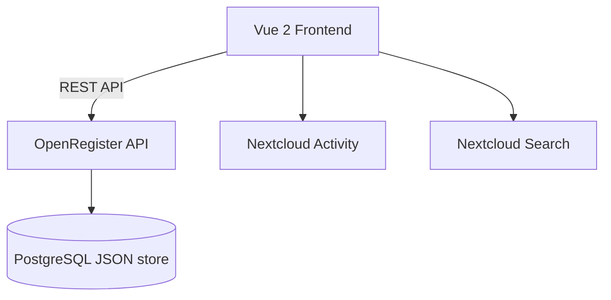

<p align="center">
  
</p>

<h1 align="center">Portaliq</h1>

<p align="center">
  <strong>One shared external portal for clients and suppliers — organisation-agnostic.</strong>
</p>

<p align="center">
  <a href="https://codeberg.org/Conduction/portaliq/releases"></a>
  <a href="https://codeberg.org/Conduction/portaliq/src/branch/main/LICENSE"></a>
  <a href="https://ci.codeberg.org/repos/Conduction/portaliq"></a>
</p>

---

Portaliq is the fleet's shared external portal. Instead of every app building its
own portal, Portaliq gives **clients** (citizens) and **suppliers** (companies)
one integrated, white-label portal to see and act on their records across every
app — reading data through **OpenRegister** and rendering each app's registered
*portal contribution*. It owns the external auth edge (DigiD / eHerkenning /
eIDAS), the white-label portal shell, the unified inbox, and the
portal-contribution registry. Employees stay internal.

> **Architecture:** hydra **ADR-046** — *Portaliq: one shared external portal,
> apps hook in.* First slice + reference implementation:
> [`openspec/changes/supplier-portal`](openspec/changes/supplier-portal) (procest
> is the first contributor).

> **Two frontends, two audiences** — this app is built on the ConductionNL
> Nextcloud app template. The template's **Vue 2.7 / nc-vue** stack (below) powers
> Portaliq's *internal* admin surface (managing contributions + tenant config).
> The *public* portal is a separate **React + NL Design System** SPA
> (`src/portal/`, built by `webpack.portal.js` → `npm run build:portal`), served
> at `/portal` via a `#[PublicPage]` template — the tilburg-woo-ui pattern for an
> external white-label surface. The template docs below describe the Vue admin side.

> **Manifest-first** — pages, navigation, and dependencies are declared in `src/manifest.json`. The shell (CnAppRoot) reads the manifest at boot and renders index / detail / dashboard / settings pages without per-page Vue files. Reach for a custom Vue component only when the page is `type: "custom"`. See `openspec/architecture/` and hydra ADR-024 for the architectural rationale.

> **Pre-wired for [OpenRegister](https://codeberg.org/Conduction/openregister)** — `manifest.dependencies` lists `openregister`, so CnAppRoot's dependency-check phase ensures the OR app is installed and enabled before the UI mounts. If your app does not need OpenRegister, remove the entry from `src/manifest.json`, `appinfo/info.xml`, and `openspec/app-config.json`.

> **Canonical root configs** — `phpcs.xml`, `phpmd.xml`, `psalm.xml`, `phpstan.neon`, and `phpstan-bootstrap.php` in this repo are the fleet canonical. All Conduction PHP apps are expected to mirror these files byte-for-byte; per-app deviations belong in baselines (`phpstan-baseline.neon`, `psalm-baseline.xml`) not in the canonical files. Submit changes here and they propagate to the fleet via the template-sync flow — do **not** diverge per-app.

## Screenshots

Screenshots are captured automatically from the tutorial flows, not pasted in by hand. The journeydoc scaffold (hydra ADR-030) ships two tutorial stories under [`docs/tutorials/`](docs/tutorials/) — a user "first launch" walkthrough (the Dashboard) and an admin "manage settings" walkthrough (Admin Settings) — and a Playwright `docs-capture` project that turns each documented step into a PNG under `docs/static/screenshots/tutorials/`.

- Add a tutorial story: `/journeydoc-add-story`
- Add stable `data-testid` hooks to a Vue component: `/journeydoc-instrument`
- (Re)capture screenshots against a running Nextcloud: `NEXTCLOUD_URL=http://localhost:8080 npx playwright test --project docs-capture`

See the [Documentation](#documentation) section below for how the docs site itself is built and deployed.

## Features

Features are defined in [`openspec/specs/`](openspec/specs/). See the [roadmap](openspec/ROADMAP.md) for planned work.

### Core
- **Dashboard** — Personal overview page with key information at a glance
- **Admin Settings** — Configurable settings panel for administrators

### Supporting
- **OpenRegister Integration** — Pre-wired data layer using OpenRegister objects
- **Quality Pipeline** — PHPCS, PHPMD, Psalm, PHPStan, ESLint, Stylelint

## Architecture



_Update this diagram during `/app-explore` sessions as the architecture evolves._

### Data Model

| Object | Description |
|--------|-------------|
| _(define your data objects here)_ | — |

_Data model is defined using OpenRegister schemas. See [`openspec/specs/`](openspec/specs/) for feature-level design decisions and [`openspec/architecture/`](openspec/architecture/) for architectural decisions._

### Portal API (external subjects)

The public portal SPA talks to these endpoints. All `contribution#*` routes are
guarded by `PortalAuthMiddleware` (bearer session required, fail-closed 401);
the session routes are the public auth edge.

| Method | Path | Purpose |
|--------|------|---------|
| `GET` | `/apps/portaliq/portal/api/session` | Resolve the caller's bearer to a subject (401 without one) |
| `POST` | `/apps/portaliq/portal/api/session/dev-login` | Mint a dev session (debug-gated; issues `trust: low`) |
| `DELETE` | `/apps/portaliq/portal/api/session` | End the client session |
| `GET` | `/apps/portaliq/portal/api/contributions` | The subject's aggregated manifest (audience- and trust-filtered) |
| `GET` | `/apps/portaliq/portal/api/collections/{register}/{schema}` | Read one collection, subject-scoped with per-row verification |
| `POST` | `/apps/portaliq/portal/api/collections/{register}/{schema}` | Create an object via a declared `type: create` action (whitelisted fields only) |
| `POST` | `/apps/portaliq/portal/api/actions/{appId}/{actionId}` | Forward a declared endpoint action server-to-server with a signed `X-Portal-Subject` assertion (contract v2, A6) |

### Contribution contract v2 (ADR-046 amendment)

A contributing app ships one plain class `OCA\{App}\Portal\PortalContributionProvider`
(duck-typed — no portaliq dependency). Contract v2 vocabulary, every field
optional with a v1-equivalent default:

- **`getAudiences(): array`** — multi-audience providers; preferred over the v1
  `getAudience(): string` (open audience vocabulary).
- **`minTrust`** on collections and actions — `low | substantial | high`
  (eIDAS-aligned). Below-threshold entries are filtered from the manifest AND
  rejected 403 server-side on read/create/action. Unrecognised values make the
  entry unsatisfiable for everyone (fail-closed).
- **`scopeClaim`** on a collection — scope by a server-managed claim from the
  subject's `portalAccount.claims` (`{appId: {claimName: uuid}}`) instead of
  the pseudonymous `subjectRef`. `"claimName"` resolves in the contributing
  app's own namespace, `"appId.claimName"` is explicit. Absent claim → the
  collection contributes zero rows (200 + empty, never an error).
- **`via`** on a collection — one-hop join scoping:
  `{register, schema, scopeField, targetField}` (dot paths allowed in
  `scopeField`). Only per-row-verified targets referenced by the subject's
  verified join rows are returned; invalid or nested declarations fail closed.
- **`fields`** on a collection (any `kind`, including `inbox`) — read-side
  projection: a pure whitelist of top-level row property names. Verified rows
  come back with ONLY those properties plus the row identifier(s) (flat
  `id`/`uuid`; an `@self` envelope reduces to its `id`/`uuid` — declare
  `"@self"` to keep it whole), so staff-only fields (e.g. internal notes)
  never leave the instance. Unknown declared names are silently absent;
  `scopeField` is not auto-included; a malformed declaration projects to
  identifiers-only (never the full row). No `fields` = full rows (v1/v2
  behaviour). Projection runs AFTER per-row verification — it shapes what a
  row shows, never which rows return.
- **Endpoint actions** — `{id, label, endpoint, method?, minTrust?}` where
  `endpoint` is an **instance-local absolute path** (full URLs rejected —
  SSRF guard). Portaliq forwards server-to-server with a ~60s HS256
  `X-Portal-Subject` assertion (`sub`/`audience`/`organisation`/`trust`/`jti` +
  `use: "assertion"`); the client's own `Authorization` header is never
  forwarded, and an assertion can never be replayed as a portal session.

Canonical contract text: ADR-046 amendment 2026-07-06 (hydra) + the
`portal-contribution-contract` spec in [`openspec/specs/`](openspec/specs/).

### Directory Structure

```
portaliq/
├── appinfo/                    # Nextcloud app manifest, routes, navigation
├── lib/                        # PHP backend
│   ├── AppInfo/Application.php
│   ├── Controller/             # DashboardController, SettingsController
│   ├── Mcp/ExampleToolProvider.php  # AI Chat Companion tools (hydra ADR-034/035)
│   ├── Service/SettingsService.php
│   ├── Listener/DeepLinkRegistrationListener.php
│   ├── Repair/InitializeSettings.php
│   └── Settings/               # AdminSettings, app_template_register.json
├── templates/                  # PHP templates (SPA shells)
├── src/                        # Vue 2 frontend
│   ├── manifest.json           # Pages + menu + dependencies (v2 — the source of truth)
│   ├── main.js                 # App entry — bootstraps CnAppRoot from manifest
│   ├── App.vue                 # Mounts CnAppRoot + #sidebar slot
│   ├── registry.js             # v2 five-kind component registry (widget/modal/page/form-field/cell-renderer)
│   ├── customComponents.js     # v1 registry (kept for backward-compat; remove once v2 migration complete)
│   ├── modals/                 # kind: "modal" components (ExampleModal.vue)
│   ├── formFields/             # kind: "form-field" components (EmailField.vue)
│   ├── cellRenderers/          # kind: "cell-renderer" components (StatusBadge.vue)
│   ├── settings.js             # Nextcloud admin settings webpack entry-point
│   ├── store/                  # Pinia stores (used by AdminSettings)
│   └── views/CustomExample.vue # Example custom component (registry demo)
├── openspec/                   # Specifications, decisions, and roadmap
│   ├── app-config.json         # Canonical app config (id, goal, dependencies, CI)
│   ├── config.yaml             # OpenSpec CLI configuration
│   ├── specs/                  # Feature specs (input for OpenSpec changes)
│   ├── architecture/           # App-specific Architectural Decision Records
│   ├── ROADMAP.md              # Product roadmap
│   └── changes/                # OpenSpec change directories (created on first change)
├── docs/                       # Docusaurus documentation site (@conduction/docusaurus-preset)
│   ├── docusaurus.config.js    # Site config — title, url, navbar, brand theme
│   ├── intro.md                # Docs landing page
│   ├── src/pages/index.js      # Marketing landing page (brand <DetailHero> / <WidgetShelf>)
│   ├── tutorials/              # journeydoc tutorial stories — user/ + admin/ tracks (ADR-030)
│   └── static/screenshots/     # Captured tutorial screenshots (populated by docs-capture)
├── tests/                      # Unit and integration tests
│   ├── e2e/docs-screenshots.spec.ts # journeydoc screenshot capture suite (Playwright docs-capture project)
│   ├── validate-manifest.js    # Ajv schema validator for src/manifest.json (nc-vue manifest schema)
│   ├── validate-register.js    # Structural validator for lib/Settings/*_register.json (slugs, lifecycle requires→PHP, clobber heuristic)
│   └── validate-json-strict.js # Strict JSON parse — rejects duplicate keys + appendOnly nested in x-openregister
├── playwright.config.ts        # Playwright config — `chromium` (regression) + `docs-capture` (screenshots) projects
├── l10n/                       # Translations (en, en_US, nl)
├── .github/workflows/          # CI/CD pipelines (incl. documentation.yml — deploys docs/ from `development`)
├── Makefile                    # Dev helpers (make dev-link)
└── img/                        # App icons and screenshots
```

## Requirements

| Dependency | Version |
|-----------|---------|
| Nextcloud | 28 – 33 |
| PHP | 8.1+ |
| Node.js | 20+ |
| [OpenRegister](https://codeberg.org/Conduction/openregister) | latest |

## Installation

### From the Nextcloud App Store

1. Go to **Apps** in your Nextcloud instance
2. Search for **Nextcloud App Template**
3. Click **Download and enable**

> OpenRegister must be installed first. [Install OpenRegister →](https://apps.nextcloud.com/apps/openregister)

### From Source

```bash
cd /var/www/html/custom_apps
git clone https://codeberg.org/Conduction/portaliq.git portaliq
cd portaliq
npm install && npm run build
php occ app:enable portaliq
```

## Development

### Start the environment

```bash
docker compose -f ../openregister/docker-compose.yml up -d
```

### Frontend development

```bash
npm install
npm run dev              # Watch mode
npm run build            # Production build
npm run check:manifest   # Validate src/manifest.json against the nc-vue manifest schema
npm run check:register   # Validate lib/Settings/*_register.json (schema shape, slugs, lifecycle requires → PHP class exists)
npm run check:json-strict # Strict JSON parse of the config files — fails on duplicate keys (the silent-data-loss class of bug a bad git merge produces)
npm run check:specs      # All three of the above — run this before committing any register/manifest change
```

> **Why `check:specs`?** `git` merges JSON files line-by-line — two branches that both add an object at the same key but at different file positions produce **no textual conflict**, just a document with a duplicate key, and `json_decode()` keeps the *last* one (so the earlier, fuller definition is silently dropped). `check:json-strict` fails CI on that. `check:register` also catches a lifecycle `requires:` pointing at a PHP class that doesn't exist, and `appendOnly` nested in `x-openregister` (which OpenRegister silently ignores). The `Spec Validation` GitHub workflow runs `check:specs` on every push/PR; add it to your branch-protection ruleset's required checks to make it block merges.

### Settings menu / NcAppSettingsDialog

The `Settings` menu entry uses `action: "user-settings"` → opens `NcAppSettingsDialog` via CnAppRoot's `cnOpenUserSettings` inject; feed your settings sections into `App.vue`'s `#user-settings` slot.

### Adding a page (manifest-first)

Pages live in [`src/manifest.json`](src/manifest.json) — NOT in
`src/views/`. To add a page, edit the manifest:

1. **Add a menu entry** in `manifest.menu` (id, label, icon, route).
2. **Add a page** in `manifest.pages` (id matches the menu's `route`).
   Pick the `type`:

   | Type        | Use when                                                    |
   |-------------|-------------------------------------------------------------|
   | `dashboard` | Home / overview with KPI widgets                            |
   | `index`     | Schema-backed list view (CnDataTable + sidebar)             |
   | `detail`    | Single-object view at `/things/:id`                         |
   | `settings`  | Admin/user settings with `version-info` / `register-mapping`|
   | `logs`      | Tail-style audit log view                                   |
   | `chat`      | Conversation thread page                                    |
   | `files`     | Folder browser                                              |
   | `custom`    | Bespoke Vue component (last resort)                         |

3. **Run `npm run check:manifest`** to verify the manifest validates.

You only write a Vue file when the page is `type: "custom"`. In that
case, drop the component into `src/views/`, register it in
[`src/customComponents.js`](src/customComponents.js), and reference
its registry name in the manifest entry's `component` field. See
[`src/views/CustomExample.vue`](src/views/CustomExample.vue) for the
canonical example.

### Renaming the app

Search-and-replace `portaliq` (the `<id>` from `appinfo/info.xml`)
in: `appinfo/info.xml`, `package.json`, `openspec/app-config.json`,
`src/main.js` (the `app-id` prop, the `loadTranslations` arg, and the
`generateUrl` base path), `src/App.vue` (the `app-id` prop and
`translateForApp` argument), and `webpack.config.js` (the `appId`
constant). The manifest itself does not carry the app id.

### Manifest v2 ready

The scaffold ships a **v2 manifest** by default (`src/manifest.json` declares
`$schema` pointing to the v2 schema URL). V2 collapses the four v1 widget
shapes into a single uniform `widgets[]` array with grid coordinates on every
page type, and introduces a five-kind component registry.

**Design reference:** hydra
[ADR-036 (Universal Widget Manifest v2)](https://codeberg.org/Conduction/hydra/src/branch/development/openspec/architecture/adr-036-universal-widget-manifest.md)

**Migration guide** (for apps migrating from v1): `@conduction/nextcloud-vue`
docs `migrating-to-v2.md` covers the codemod CLI and manual migration steps.

#### Extending the app via the registry (`src/registry.js`)

The v2 way to add custom UI is `src/registry.js`. It has five kinds:

| kind | Use when |
|------|----------|
| `widget` | Custom placeable widget — add to any page's `widgets[]` via `widgetKey` |
| `modal` | Dialog opened by manifest actions with `type: "open-modal"` |
| `page` | Bespoke full-page component (`type: "custom"` in the manifest — use sparingly) |
| `form-field` | Custom form input auto-bound by JSON Schema `format` |
| `cell-renderer` | Custom table-cell rendering auto-bound by schema + property |

Steps to add a custom widget:

1. Create `src/widgets/<YourWidget>.vue`.
2. Add an entry to `src/registry.js` with `kind: "widget"` + `defaultSize`, `minSize`, `maxSize`, `allowedSlots`, `propsSchema`.
3. Add a `widgets[]` entry to the target page in `src/manifest.json` with `widgetKey: "<your-key>"`, `slot`, and grid coordinates.
4. Run `npm run check:manifest-v2` to validate.

The scaffold ships one example per kind as a starting point. Delete or
replace the examples when you clone the template.

> **Backward compat:** `src/customComponents.js` is kept for the v1 → v2
> transition period. Both the `customComponents` and `registry` props coexist
> on `CnAppRoot`. Once fully migrated, `customComponents.js` and its import in
> `main.js` can be removed.

### Adding a dashboard widget

Each Nextcloud Dashboard widget is **three files plus two registration
points**:

1. `lib/Dashboard/<Foo>Widget.php` — implements `OCP\Dashboard\IWidget`. The
   `load()` method MUST attach the two shared chunks (`-shared-vendor`,
   `-shared-nc-vue`) **before** the per-widget bundle. Order matters.
2. `src/<foo>Widget.js` — webpack entry-point that registers the renderer via
   `OCA.Dashboard.register('<id>', (el, { widget }) => { ... })`. The id MUST
   equal `Widget::getId()` from PHP.
3. `src/views/widgets/<Foo>Widget.vue` — the renderer itself. Wrap in
   `<NcDashboardWidget>` for free loading + empty states.
4. Register in `lib/AppInfo/Application.php`: add
   `$context->registerDashboardWidget(<Foo>Widget::class);`.
5. Add a webpack entry in `webpack.config.js` so `npm run build` produces
   `<appId>-<foo>Widget.js`.

The `optimization.splitChunks` block in `webpack.config.js` extracts shared
framework code (Vue, `@nextcloud/vue`, pinia, icons) into two chunks loaded
once across the page. Without it every widget bundle would inline ~3 MB of
duplicated framework code per entry-point. See ADR-004 (Build / bundling)
in the hydra repo for the full rationale.

### AI Chat Companion / MCP tools

The template ships an example **MCP tool provider** so the in-app AI Chat
Companion (a floating assistant rendered by `CnAppRoot` from
`@conduction/nextcloud-vue`) can call your app's capabilities. See:

- `lib/Mcp/ExampleToolProvider.php` — the heavily-commented starting point. It
  implements `OCA\OpenRegister\Mcp\IMcpToolProvider` and exposes two trivial
  tools: `portaliq.ping` (echoes a message) and `portaliq.describeApp`
  (returns the app id, version, and name).
- `lib/AppInfo/Application.php` — registers the provider under the service
  alias `OCA\OpenRegister\Mcp\IMcpToolProvider::{appId}`; OpenRegister's
  `McpToolsService` discovers per-app providers by exactly that alias.
- `tests/Stubs/Mcp/IMcpToolProvider.php` — a stand-in for the interface until
  [openregister PR #1466](https://codeberg.org/Conduction/openregister/pulls/1466)
  merges; once the openregister app is installed alongside your app the real
  interface takes over transparently.
- `tests/Unit/Mcp/ExampleToolProviderTest.php` — the contract test.

**To wire up your app:**

1. Rename `ExampleToolProvider` → `{YourApp}ToolProvider` (update the alias in
   `Application.php` and the test).
2. Replace the two example tools with real ones — each descriptor needs
   `id` (`{appId}.{toolName}`), `name`, `description`, and an `inputSchema`
   (JSON Schema object).
3. In `invokeTool()`, **run per-object authorisation before any business logic
   or data access** — validate args, then authorise, then delegate, then
   return. `invokeTool()` MUST NOT throw — every failure path returns a
   structured `['error' => ['code' => ..., 'message' => ...]]` array.

References: hydra
[ADR-034 (AI Chat Companion)](https://codeberg.org/Conduction/hydra/src/branch/development/openspec/architecture/adr-034-ai-chat-companion.md)
and ADR-035; and decidesk's `OCA\Decidesk\Mcp\DecideskToolProvider` as the
production example (five real tools, deep links, source descriptors).

### Code quality

```bash
# PHP
composer check:strict   # All quality checks (PHPCS, PHPMD, Psalm, PHPStan, tests)
composer cs:fix         # Auto-fix PHPCS issues
composer phpmd          # Mess detection
composer phpmetrics     # HTML metrics report

# Frontend
npm run lint            # ESLint
npm run stylelint       # CSS linting
```

### Enable locally

Nextcloud requires the app directory name to match the `<id>` in `appinfo/info.xml` (`portaliq`).
When this repo is cloned as `portaliq`, create a relative symlink first.

> **Note:** The `js/` build output is not committed. You must build the frontend before enabling the app, or the UI will be blank.

```bash
make dev-link
npm install && npm run build
docker exec nextcloud php occ app:enable portaliq
```

## Tech Stack

| Layer | Technology |
|-------|-----------|
| Frontend | Vue 2.7, Pinia, @nextcloud/vue |
| Build | Webpack 5, @nextcloud/webpack-vue-config |
| Backend | PHP 8.1+, Nextcloud App Framework |
| Data | OpenRegister (PostgreSQL JSON objects) |
| UX | @conduction/nextcloud-vue |
| Quality | PHPCS, PHPMD, Psalm, PHPStan, ESLint, Stylelint |

## Branches

| Branch | Purpose |
|--------|---------|
| `main` | Stable releases — triggers release workflow |
| `beta` | Beta / pre-release builds |
| `development` | Active development — merge target for feature branches |

## Documentation

The user-facing documentation site lives in [`docs/`](docs/) — a Docusaurus site built on [`@conduction/docusaurus-preset`](https://www.npmjs.com/package/@conduction/docusaurus-preset) with the brand `<DetailHero>` / `<WidgetShelf>` landing page, the journeydoc tutorial scaffold ([`docs/tutorials/`](docs/tutorials/) — user "first launch" + admin "manage settings"), and the Playwright `docs-capture` project for screenshots (hydra ADR-030).

`.github/workflows/documentation.yml` deploys the site on every push to `development`: it runs `cd docs && npm ci && npm run build` and publishes to `<slug>.conduction.nl` (the template's placeholder slug is `portaliq`, so `portaliq.conduction.nl` — `docs/static/CNAME` carries this and is rewritten by the renaming pass). Build the site locally with:

```bash
cd docs
npm ci --legacy-peer-deps
npm run build      # → build/  ([SUCCESS] Generated static files)
npm run start      # local dev server with hot reload
```

Project / spec documentation:

| Resource | Description |
|----------|-------------|
| [`openspec/app-config.json`](openspec/app-config.json) | App identity, goals, dependencies, and CI configuration |
| [`openspec/specs/`](openspec/specs/) | Feature specs — what the app should do |
| [`openspec/architecture/`](openspec/architecture/) | App-specific Architectural Decision Records |
| [`openspec/ROADMAP.md`](openspec/ROADMAP.md) | Product roadmap |
| [`openspec/`](openspec/) | Implementation specifications and changes |

## Standards & Compliance

- **Accessibility:** WCAG AA (Dutch government requirement)
- **Authorization:** RBAC via OpenRegister
- **Audit trail:** Full change history on all objects
- **Localization:** English and Dutch

## Related Apps

- **[OpenRegister](https://codeberg.org/Conduction/openregister)** — Object storage layer (required dependency)

_Add related apps here as integrations are built._

## Troubleshooting

### App UI is blank after enabling

The `js/` build output is not committed to the repo. Run the frontend build before enabling the app:

```bash
npm install && npm run build
```

### "Could not download app portaliq" when running `occ app:enable`

Nextcloud requires the app directory name to exactly match the `<id>` in `appinfo/info.xml`. When this repo is cloned as `portaliq`, create a symlink first:

```bash
make dev-link   # creates apps-extra/portaliq -> portaliq
```

Then enable the app again:

```bash
docker exec nextcloud php occ app:enable portaliq
```

## Support

For support, contact us at [support@conduction.nl](mailto:support@conduction.nl).

For a Service Level Agreement (SLA), contact [sales@conduction.nl](mailto:sales@conduction.nl).

## License

This project is licensed under the [EUPL-1.2](LICENSE).

### Dependency license policy

All dependencies (PHP and JavaScript) are automatically checked against an approved license allowlist during CI. The following SPDX license families are approved:

- **Permissive:** MIT, ISC, BSD-2-Clause, BSD-3-Clause, 0BSD, Apache-2.0, Unlicense, CC0-1.0, CC-BY-3.0, CC-BY-4.0, Zlib, BlueOak-1.0.0, Artistic-2.0, BSL-1.0
- **Copyleft (EUPL-compatible):** LGPL-2.0/2.1/3.0, GPL-2.0/3.0, AGPL-3.0, EUPL-1.1/1.2, MPL-2.0
- **Font licenses:** OFL-1.0, OFL-1.1

## Authors

Built by [Conduction](https://conduction.nl) — open-source software for Dutch government and public sector organizations.
